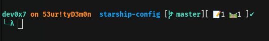

# Starship Configuration

This repository contains the configuration file (starship.toml) for my Starship prompt. Starship is a minimal, , and cross-shell prompt that enhances the command-line interface with useful information and customizable prompts.

# Table of Contents
- [Getting Started](#getting-started)
  - [Prerequisites](#prerequisites)
  - [Installation](#installation)
  - [Overview](#overview)
  - [Customization](#customization)
- [Example](#example)
- [Contributing](#contributing)

## Getting Started

### Prerequisites

Before you begin, ensure that you have the following installed:

- Starship - The prompt itself.
- A compatible shell (e.g., , Zsh, Fish).

### Installation

**Install Starship:**

Follow the official [Starship installation guide](https://starship.rs/guide/#🚀-installation) to install Starship on your system.

**Clone this Repository:**

```
$ git clone https://github.com/NishanthAnand21/starship-config.git

Copy Configuration File:

$  cp starship-configuration/starship.toml ~/.config/starship.toml

Source Configuration File:
Depending on your shell, add the following line to your shell profile file (e.g., ~/.rc, ~/.zshrc, ~/.config/fish/config.fish):


Replace <shell> with your shell of choice (e.g., , zsh, fish):
$ eval "$(starship init <shell>)"


Restart Your Shell:
Restart your shell or run source ~/.your-shell-profile to apply the changes.
```
Configuration

# Overview

The starship.toml file in this repository servesthe configuration file for Starship. It defines how the prompt should look and what information it should display. The configuration is written in TOML (Tom's Obvious, Minimal Language).



# Customization

You can customize variousects of the prompt, including prompt symbols, colors, and displayed information. Refer to the official Starship configuration documentation for detailed information on customization options.

# Contributing

Feel free to contribute to this repository by submitting issues, providing feedback, or making pull requests. Contributions are welcome!

In this README, I've included sections for getting started, configuration details, an example screenshot and a section on contributing. You can further customize and expand d on your specific needs and preferences. Additionally, make sure to replace placeholders like yourusername and example.png with your actual GitHub username and example screenshot file path, respectively.
